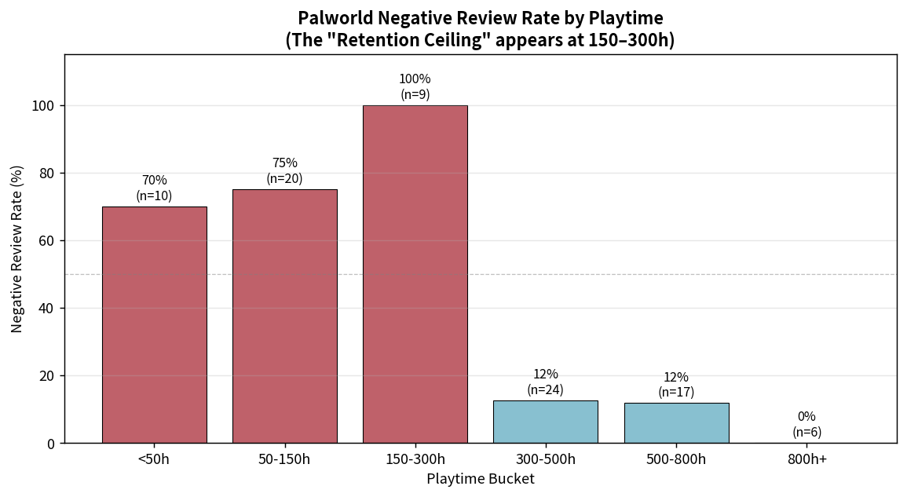
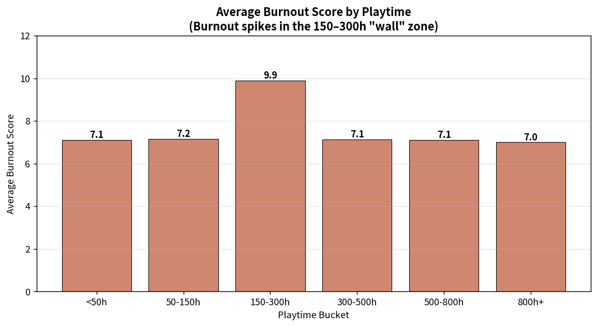
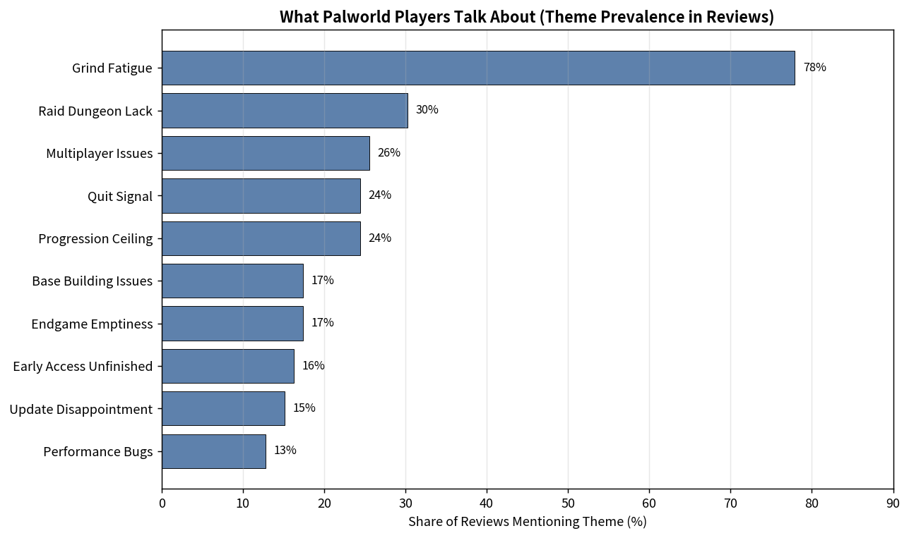
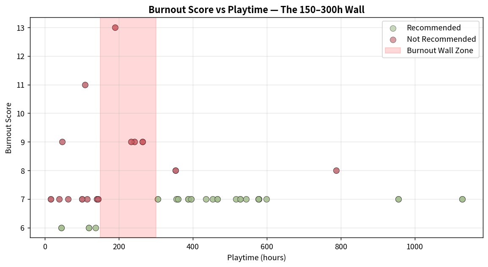

# The 300-Hour Wall: A Retention Ceiling Analysis of *Palworld*

A portfolio-ready game systems analysis project focused on **retention loop breakdown**, **endgame dissatisfaction**, and the **mid-game burnout wall** in *Palworld*.

This project examines player-review data to answer a core design question:

> **At what point do players stop enjoying the loop, and why?**

Using review text, recommendation signals, playtime, and a burnout severity score, the analysis identifies a sharp **retention ceiling at 150–300 hours**. The key finding is that burnout is not simply caused by “too many hours played.” Instead, the data suggests a structural issue: players hit a transition point where the progression loop loses meaning before the creative sandbox loop fully takes over.

---

## Project Highlights

- **86 player reviews** analyzed
- **Playtime range:** ~15h to ~1,128h
- **Primary finding:** a **100% negative-review rate** in the **150–300h** playtime cohort
- **Core insight:** endgame dissatisfaction is driven more by **grind fatigue and reward-value collapse** than by a pure lack of content
- **Design conclusion:** *Palworld* appears to need a stronger **“300-hour bridge” system** to carry players from progression-driven play into long-term sandbox play

---

## Repository Contents

```text
.
├── README.md
├── Palworld_Retention_Analysis.ipynb
├── palworld_burnout_reviews.csv
├── palworld_processed_with_themes.csv
├── reports/
│   └── Palworld_Case_Study_The_300-Hour_Wall.pdf
├── visuals/
│   ├── chart1_retention_ceiling.png
│   ├── chart2_burnout_score.png
│   ├── chart3_themes.png
│   └── chart4_scatter.png
├── requirements.txt
├── environment.yml
└── .gitignore
```

---

## Deliverables

### 1) Business-facing PDF report
A polished, portfolio-ready report written for a game planning / product analysis audience.

**Includes:**
- research objective and context
- methodology overview
- cohort analysis by playtime
- theme extraction from reviews
- visualized findings
- design recommendations with expected KPI impact

📄 File: `reports/Palworld_Case_Study_The_300-Hour_Wall.pdf`

### 2) Jupyter notebook appendix
A clean and well-commented notebook that documents the full analytical workflow in Python.

**Includes:**
- environment setup
- data loading and inspection
- cohort segmentation by playtime
- keyword-based theme extraction
- sentiment cross-tabulation
- survivor cohort comparison
- correlation checks
- explanatory markdown for *what* each step does and *why* it is used

📓 File: `Palworld_Retention_Analysis.ipynb`

---

## Key Visuals

### Negative review rate by playtime
This chart shows the clearest signal in the project: the 150–300h band acts as a retention ceiling.



### Average burnout score by playtime
Burnout peaks in the same wall-zone cohort, supporting the retention ceiling interpretation.



### Theme prevalence in player reviews
Grind fatigue dominates discussion more than pure “no content” complaints.



### Burnout score vs playtime
Players beyond the wall tend to stabilize into lower burnout, suggesting a shift into a different long-term play mode.



---

## Main Findings

### 1. The retention problem is concentrated, not gradual
Negative sentiment does not simply rise with playtime. Instead, dissatisfaction spikes dramatically in the **150–300h** segment, then drops again for players who continue beyond that point.

### 2. Endgame dissatisfaction is about meaning, not volume
Players do mention endgame emptiness, but the stronger theme is **grind fatigue**. This suggests the problem is not just “more content is needed,” but that existing activities stop feeling rewarding.

### 3. Long-term survivors are playing a different game
Players who remain after 300+ hours appear more likely to engage with *Palworld* as a **creative sandbox** rather than a strictly progression-based system.

### 4. Burnout appears structural
The analysis suggests that burnout is tied to a **specific transition point in the player journey**, not merely to extended exposure.

---

## Methods Used

- **Cohort analysis** using playtime buckets
- **Keyword-based theme extraction** from review text
- **Sentiment cross-tabulation** between themes and recommendation labels
- **Correlation checks** across playtime, recommendation, and burnout score
- **Data visualization** for design communication

### Why a keyword approach?
For a small dataset, an auditable keyword framework is easier to explain and defend than a black-box topic model. This is especially useful in a portfolio setting where design reasoning matters as much as technical output.

---

## Tech Stack

- Python
- pandas
- numpy
- matplotlib
- Jupyter Notebook

---

## How to Run

### Option 1: pip + virtual environment
```bash
python -m venv .venv
source .venv/bin/activate  # On Windows: .venv\Scripts\activate
pip install -r requirements.txt
jupyter notebook
```

Then open:

```text
Palworld_Retention_Analysis.ipynb
```

### Option 2: conda
```bash
conda env create -f environment.yml
conda activate palworld-retention
jupyter notebook
```

---

## Portfolio Value

This project was designed for a **Game Planning Analyst / Systems Analyst** portfolio. It demonstrates:

- game-system thinking
- player-journey segmentation
- player sentiment interpretation
- translating data into design recommendations
- communicating findings in both technical and business-friendly formats

---

## Notes

- The dataset is a small, review-based sample and should be treated as **directional rather than definitive**.
- The burnout score is a provided / derived proxy, not an internal telemetry metric.
- In a production environment, the next step would be validating these findings against session, churn, feature-usage, and retention telemetry.

---

## Author

Portfolio project by **Stabilini Vlada**  
Role focus: **Player-first systems analysis, retention loops, game planning + data**
